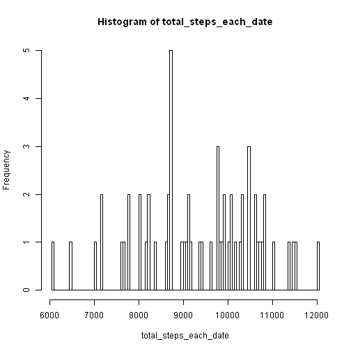
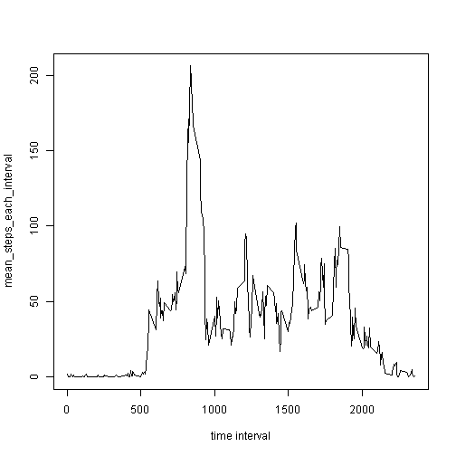
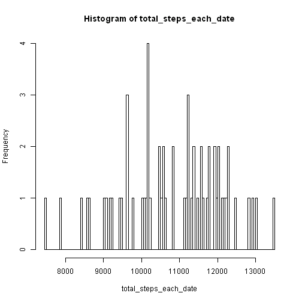
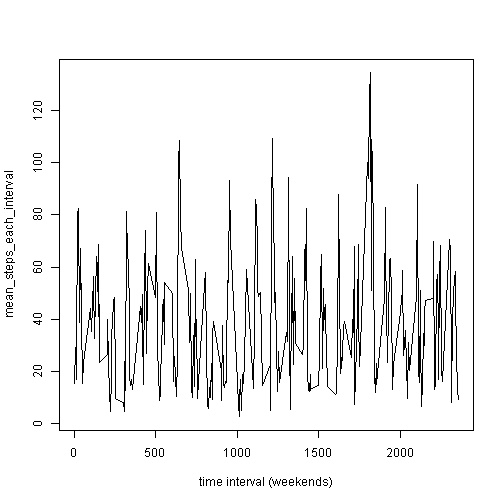
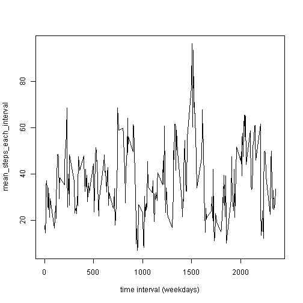

Dataset: Activity monitoring data
======

# A. Loading and preprocessing the data, both done here #
### 1. Load the data (i.e. read.csv()) ###
### 2. Process/transform the data ###


```r
# convert to numeric from factor get levels of factor, etc.
all = read.csv("activity.csv")
steps = as.numeric(all$steps)
intervals = levels(as.factor(all$interval))
dates = levels(as.factor(all$date))
```


# B. What is mean total number of steps taken per day? #

### 1. Make a histogram of the total number of steps taken each day ###


```r
# calc steps per day, for each day
total_steps_each_date = numeric()
for (date_i in dates) {
    # work here
    steps_in_date_i = steps[dates == date_i]
    total_date_i = sum(steps_in_date_i, na.rm = TRUE)  # ignore missing
    total_steps_each_date = c(total_steps_each_date, total_date_i)
    # fill in mean for day while we have it for later use with NA new data set
    sel = all$date == date_i
    all$mean[sel] = mean(steps_in_date_i, na.rm = TRUE)  # ignore missing
}
hist(total_steps_each_date, breaks = 100)
```

 

### 2. Calculate mean() and median() of above ###

```r
print(c("mean = ", mean(total_steps_each_date)), quote = F)
```

```
## [1] mean =           9354.22950819672
```

```r
print(c("median = ", median(total_steps_each_date)), quote = F)
```

```
## [1] median =  9408
```


# C. What is the average daily activity pattern? #

### 1. Time-series plot of the average daily activity pattern ###


```r
mean_steps_each_interval = numeric()
for (interval in intervals) {
    steps_in_interval_i = steps[intervals == interval]
    ave_interval_i = mean(steps_in_interval_i, na.rm = TRUE)  # ignore missing
    mean_steps_each_interval = c(mean_steps_each_interval, ave_interval_i)
}
plot(intervals, mean_steps_each_interval, type = "l", xlab = "time interval")
```

 


### 2. 5 minute Time interval with the maximum number of steps is... ###


```r
sel = mean_steps_each_interval == max(mean_steps_each_interval)
print(c("interval w/ max # steps = ", intervals[sel]))
```

```
## [1] "interval w/ max # steps = " "835"
```


# D. Importing missing values #

### 1. Calculate and report the total number of missing values in the dataset ###


```r
print(c("total NA = ", sum(is.na(all$steps))), quote = F)
```

```
## [1] total NA =  2304
```

### 2. Devise a strategy for filling in all of the missing values in the dataset ###

I will replace missing values with the mean of the values for that day.

### 3. Create a new dataset that is equal to the original dataset but with the missing data filled in ###

This was mostly calculated above (when data was first analysed for totals, and means stored in the dataset), just replace the missing dataset steps values here:


```r
replace = is.na(all$steps)
all$steps[replace] = all$mean[replace]
steps = as.numeric(all$steps)
intervals = levels(as.factor(all$interval))
dates = levels(as.factor(all$date))
print(c("# NAs with NAs removed = ", sum(is.na(all$steps))), quote = F)
```

```
## [1] # NAs with NAs removed =  0
```

### 4. Make a histogram of the total number of steps taken each day and calculate and report the mean and median ###

Since I have replaced the missing data in the dataset, I can use the same functions as above to recalculate the histogram, mean, median; but do not have to worry about NAs.

```r
# calc steps per day, for each day, with NAs filled in
total_steps_each_date = numeric()
for (date_i in dates) {
    steps_in_date_i = steps[dates == date_i]
    total_date_i = sum(steps_in_date_i, na.rm = FALSE)  # should be NO missing
    total_steps_each_date = c(total_steps_each_date, total_date_i)
}
hist(total_steps_each_date, breaks = 100)
```

 

### 5. mean() and median() of above ###

```r
print(c("mean = ", mean(total_steps_each_date)), quote = F)
```

```
## [1] mean =           10790.1968825563
```

```r
print(c("median = ", median(total_steps_each_date)), quote = F)
```

```
## [1] median =         10819.3211461943
```


### 6. Do these differ from the first part of assignment? 

yes

### 7. What is the impact? ###

not too significant, both increase slightly as to be expected.

# Are there differences in activity patterns between weekdays and weekends? #

Well, hard to tell.  Maybe. Maybe not depending on how you look at the data.


```r
sel = weekdays(as.Date(dates)) %in% c("Saturday", "Sunday")
stepsx = steps[sel]

mean_steps_each_interval = numeric()
for (interval in intervals) {
    steps_in_interval_i = stepsx[intervals == interval]
    ave_interval_i = mean(steps_in_interval_i, na.rm = FALSE)  # no missing
    mean_steps_each_interval = c(mean_steps_each_interval, ave_interval_i)
}
plot(intervals, mean_steps_each_interval, type = "l", xlab = "time interval (weekends)")
```

 

```r


stepsx = steps[!sel]

mean_steps_each_interval = numeric()
for (interval in intervals) {
    steps_in_interval_i = stepsx[intervals == interval]
    ave_interval_i = mean(steps_in_interval_i, na.rm = FALSE)  # no missing
    mean_steps_each_interval = c(mean_steps_each_interval, ave_interval_i)
}
plot(intervals, mean_steps_each_interval, type = "l", xlab = "time interval (weekdays)")
```

 

```r

```

